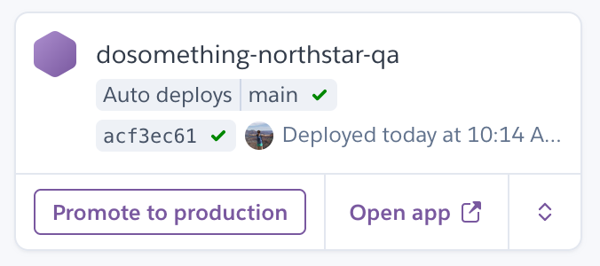
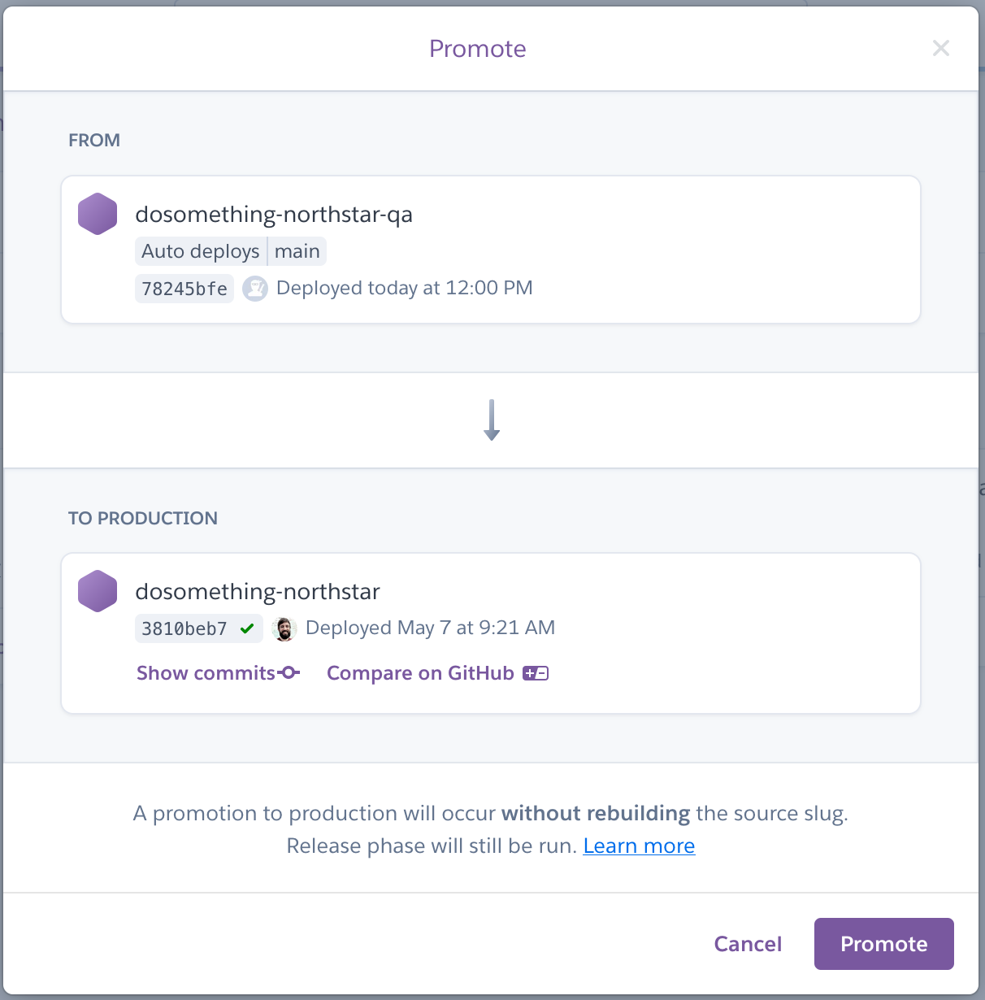

# How We Deploy

## Heroku

Most of our apps are [deployed via Heroku](https://devcenter.heroku.com/articles/pipelines#promoting). The steps below outline how to deploy using Heroku.

### Step 1 - Check Status

See if anything needs to be deployed! Go to the app's pipeline in Heroku and you will see what has been deployed on `dev`, `qa`, and `prod`. Anything merged into the `main` branch will automatically be deployed to `dev` and `qa`. If `qa` has a "Promote to production" button on it, it means there is new work that has not yet been deployed to production. Click the button but don't worry, this won't deploy anything yet!

### Step 2 - View Changes

The following modal will pop up. Here you can click "Compare on GitHub" to see what changes are on deck to be deployed and make sure everything on deck is ready for production. Keep that tab open until the deploy is complete, you'll need to link to it in the next step.

### Step 3 - Deploy!

When you're ready to deploy to production, click the "Promote" button in the modal. After the deploy finishes, an automatic notification will appear in the #deploys channel in Slack. Thread off of that message and include a brief description of the work being deployed, link to the GitHub diff, and tag anyone whose code is being deployed alongside yours.
