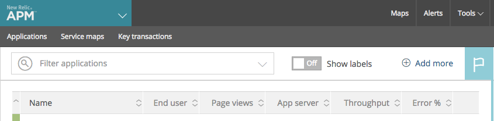
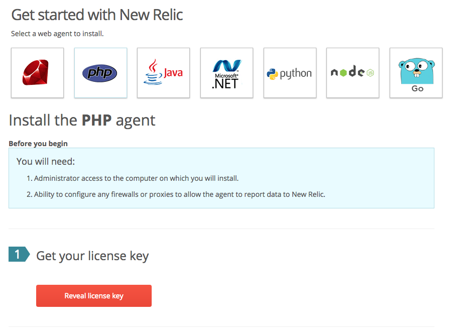

# New Relic

## What
[New Relic](https://newrelic.com/) is a service to help measure and monitor an application's performance, provides extensive alerting and helps pinpoint and troubleshoot errors.


## Why
At DoSomething.org we use New Relic to keep a watchful eye on all our services and alert us as soon as possible if any problems arise.

New Relic offers a number of products but we specifically use the following:
- **APM - Application Performance Monitoring**
- **Synthetics**
- **Browser**
- **Insights**

## How
Most of DoSomething.org's applications are hosted using the Heroku platform, and setting up New Relic monitoring on this platform is somewhat different than what is specified on the New Relic or Heroku documentation.

### Setup
To setup a new New Relic APM app, from the APM section, click on the **Add more** button at the top right above the existing app list:



Next select a web agent language to set for the new app, and then click the button to get the license key for this new app:




#### Heroku
Within the Heroku configuration for the app, head to the **Settings** tab, and click the **Reveal Config Vars** in the **Config Vars** section and add the following environment variables, including the license key obtained above:

```
NEW_RELIC_APP_NAME="YOUR_APP_NAME"
NEW_RELIC_LICENSE_KEY='YOUR_LICENSE_KEY'
NEW_RELIC_LOG="stdout"
```


## Related Resources
- [Heroku New Relic APM Documentation](https://devcenter.heroku.com/articles/newrelic)
