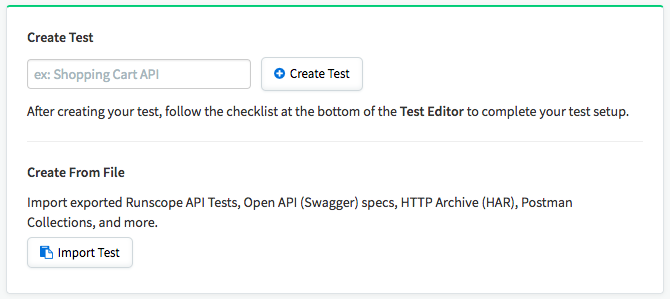
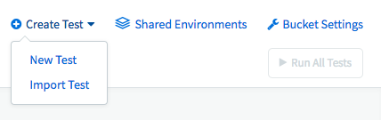
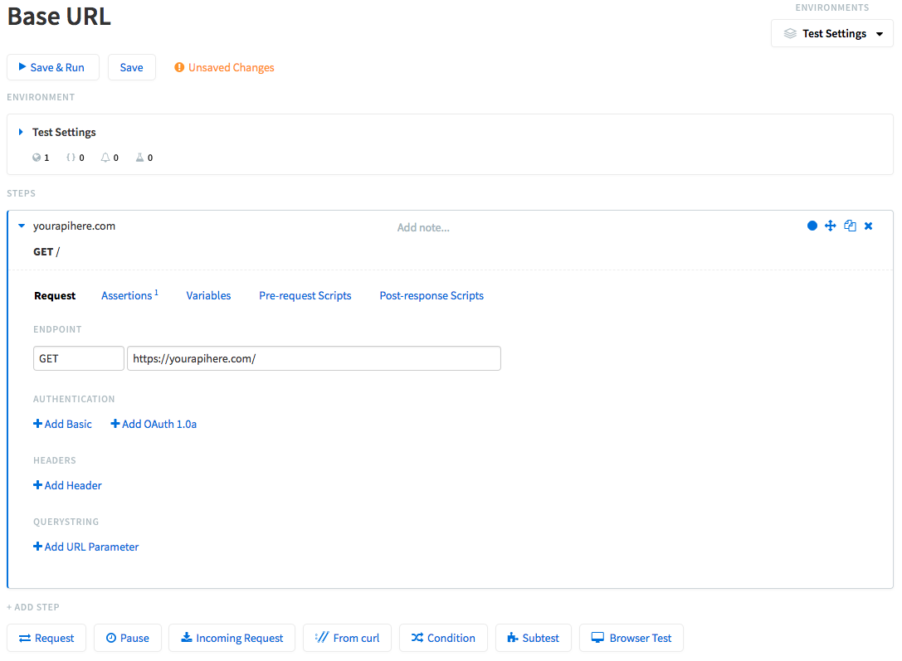

# Runscope

## What
[Runscope]() is a service to help monitor API endpoints for an application and let you know when the API is running slow or is down.

## Why
At DoSomething.org we use Runscope to help monitor API endpoints for a variety of services, such as:
- Ashes
- Bertly
- Blink
- Gambit
- Northstar
- Phoenix
- Rogue

It helps provide information regarding the health of the variety of API endpoints in our system. Runscope tests run across our environments (QA and Production) so we are also alerted when a breaking change is introduced.

## How
_Ideally a Runscope tests exists for each API endpoint for a service._

If setting up a new application you will want to create a new **Bucket** via the Organization dropdown menu and clicking to **Create Bucket**.

### Setup
To setup a new test use the **Create Test** dialog if in a new Bucket:

Otherwise, you can use the **Create Test** dropdown:

Once you create the new test, proceed to fill out the **Environment** and **Steps** settings:

